# ANTIGRAVITY RESEARCH & ENGINEERING SPECIFICATION
## DOCUMENT 07: ELECTRICAL SCHEMATIC & CONTROL CIRCUITRY DESIGN
### Power Architecture, Safety Interlocks, Driver Topology, and Fail-Safe Logic
**Document ID:** AGY-AGB-ELEC-001 | **Revision:** 1.0  
**Standards Compliance:** IEC 60204-1 (Safety of Machinery - Electrical Equipment), IEC 60947-5-1, IS 732

---

## 1. POWER ARCHITECTURE & HYBRID SUPPLY INTERFACE

The electrical architecture operates natively on a **24 V DC Safety Extra-Low Voltage (SELV)** bus. This provides complete electrical safety for female SHG operators (zero risk of lethal electric shock even in damp rural shed environments) and enables direct, high-efficiency coupling to both off-grid solar battery systems and standard AC grid power.

```mermaid
graph LR
    subgraph Power Sources
        A1[Solar PV Array 100W] --> A2[MPPT Controller]
        A2 --> B1[24V 30Ah LiFePO4 Battery]
        C1[230V AC Grid Utility] --> C2[24V 15A Industrial SMPS]
    end

    subgraph DC Power Bus & Safety Train
        B1 --> D[Main Power Selector Switch]
        C2 --> D
        D --> E[20A Fast-Acting DC Blade Fuse]
        E --> F[Schottky Reverse Polarity Diode]
        F --> G[Emergency Stop Switch NC Contact]
        G --> H[24V DC Internal Bus Bar]
    end

    subgraph Control & Safety Interlocks
        H --> I[DC-DC Buck Converter 24V -> 5V/12V]
        I --> J[Digital Pulse Timer Controller]
        H --> K[Jaw Closure Safety Microswitch NC Positive-Break]
        J --> L[AND-Gate Interlock Logic]
        K --> L
    end

    subgraph Power Stage & Heater Load
        L --> M[Optocoupled MOSFET / DC SSR Driver]
        H --> N[Thermal Cutoff Fuse 180°C on Jaw]
        N --> M
        M --> O[Nichrome 80/20 Sealing Element 1.25 Ohm]
        O --> P[Current Sense Shunt Resistor 10mOhm]
        P --> Q[Power Ground Return]
    end
```



---

## 2. DETAILED ELECTRICAL SCHEMATIC & COMPONENT WIRING

### 2.1 Complete ASCII Circuit Schematic
```text
 +24V DC IN (Battery / SMPS)
     │
    [F1: 20A Fast DC Blade Fuse]
     │
    [D1: 30A 45V Schottky Diode - Reverse Polarity Protection]
     │
    [SW1: E-STOP Pushbutton - Mushroom Head, Positive Break NC Contact]
     │
     ├───► [DC-DC Converter: 24V -> 12V Regulated] ───► [Timer Controller VCC]
     │                                                        │
     │                                                        ▼
     │                                              [Start Trigger In]
     │                                                        │
     ├───► [SW2: Safety Microswitch - Closed ONLY when Jaw fully down]
     │          │
     │          ▼
     │     [Timer Trigger Pulse: 0.75 s Precision One-Shot]
     │          │
     │          ▼
     │     [Optocoupler Isolator: PC817 / TLP250]
     │          │
     │          ▼
     │     [Q1 Gate: High-Side / Low-Side N-MOSFET or DC SSR Fotek 60V 30A]
     │          │
     ├───► [TF1: Thermal Cutoff Fuse 180°C clamped directly on Upper Jaw]
     │          │
     │          ▼
     │     [ Nichrome 80/20 Ribbon Element: 220 mm x 2.5 mm x 0.08 mm ]
     │     [ Cold R = 1.20 Ohm, Hot R = 1.25 Ohm, P = 275 W Effective ]
     │          │
     │          ▼
     │     [Drain of N-Channel Power MOSFET: IRFP064N / AOT2904 (100V, 140A, Rds=3.5 mOhm)]
     │          │
     │     [Source connected to Current Sense Resistor: 10 milli-Ohm 5W]
     │          │
     └──────────┴───────────────────────────────────────────────────────► Power Return (GND)
```

---

## 3. WIRE GAUGE SELECTION & VOLTAGE DROP CALCULATION

During the $0.75\text{ s}$ impulse heating phase, the Nichrome ribbon draws a peak operating current:
$$I_{\text{peak}} = \frac{V_{\text{bus}}}{R_{\text{op}}} = \frac{24.0\text{ V}}{1.252\ \Omega} = 19.17\text{ A}$$
With $60\%$ PWM duty cycle, the RMS current is $I_{\text{RMS}} = 14.85\text{ A}$.

* **Conductor Material:** Class 5 flexible stranded annealed copper (IS 694 / IEC 60228).
* **Conductor Size:** $2.5\text{ mm}^2$ (equivalent to AWG 14).
* **Total Loop Wire Length (Supply + Return):** $L_{\text{wire}} = 1.50\text{ m} \times 2 = 3.0\text{ m}$.
* **Copper Resistivity at $20^\circ\text{C}$:** $\rho_{\text{Cu}} = 1.72 \times 10^{-8}\ \Omega\cdot\text{m}$.
* **Resistance of Cable Run ($R_{\text{cable}}$):**
  $$R_{\text{cable}} = \frac{\rho_{\text{Cu}} \times L_{\text{wire}}}{A_{\text{cable}}} = \frac{1.72 \times 10^{-8}\ \Omega\cdot\text{m} \times 3.0\text{ m}}{2.5 \times 10^{-6}\text{ m}^2} = 0.02064\ \Omega$$
* **Voltage Drop ($\Delta V_{\text{cable}}$) at Peak Current $19.17\text{ A}$:**
  $$\Delta V_{\text{cable}} = I_{\text{peak}} \times R_{\text{cable}} = 19.17\text{ A} \times 0.02064\ \Omega = 0.395\text{ V}$$
* **Percentage Voltage Drop:**
  $$\%\Delta V = \frac{0.395\text{ V}}{24.0\text{ V}} \times 100 = 1.65\%$$
* **Standard Verification:** Well below the maximum allowable $3.0\%$ voltage drop threshold defined in **IEC 60204-1 §5.2**. Cable heating is completely negligible ($P_{\text{loss}} = I_{\text{RMS}}^2 \times R_{\text{cable}} = (14.85)^2 \times 0.02064 = 4.55\text{ W}$ for only $0.75\text{ s} = 3.41\text{ J}$). — **Classification: B (Calculated) / A (Standard Verified)**

---

## 4. CONTROL STRATEGY COMPARISON & SELECTION

| Control Strategy | Sensing & Control Hardware | Cost Index (INR) | Sealing Consistency across Shifts | Cold-Start First Cycle Defect Risk | Circuit Complexity & Field Reliability | Evaluation Verdict |
|---|---|---|---|---|---|---|
| **Strategy A: Fixed-Time Impulse Control** | Analog/Digital 555 or R-C timer dial; no temperature feedback | **INR 250 - 450** | Poor. First 3 cycles underheat (cold jaw); after 20 cycles jaw warms up and film burns | High (Cold seal peel failure) | Very Simple; Highly durable in dusty environments | Baseline hobby method; inadequate for commercial quality |
| **Strategy B: Pure Temperature-Based (Continuous Thermostat)** | Thermocouple + On/Off temperature controller | INR 950 - 1,400 | Poor for impulse. Heavy thermal lag in ribbon causes massive temperature overshoot | Medium | Moderate; ribbon burns out quickly | Unsuitable for low-thermal-mass impulse strips |
| **Strategy C: Temperature-Compensated Dual-Timer (Recommended V1)** | Digital Microcontroller / Dual-Timer + K-Type probe on jaw body | **INR 650 - 850** | **Outstanding.** Dynamically adjusts impulse pulse ($0.85\text{s}$ on cold start $\to 0.70\text{s}$ at steady state) | **Zero (Auto cold-start boost)** | **Low-Medium; robust industrial implementation** | **WINNER: Optimal balance of cost, simplicity, and repeatability** |
| **Strategy D: Full Closed-Loop High-Speed PID** | High-speed IR sensor / resistance feedback ($R(T)$) + DSP/PLC | INR 4,500 - 8,500 | Perfect (±1°C real-time accuracy) | Zero | Very High; sensor alignment vulnerable to dust and oil | Overengineered for rural SHG production; prohibitive cost |

---

## 5. FAIL-SAFE INTERLOCK LOGIC & SAFETY ARCHITECTURE

In compliance with **ISO 13849-1 (Safety-Related Parts of Control Systems - Category 1 / PL c)**:
1. **Positive-Break Normally-Closed (NC) E-Stop:** The Emergency Stop button uses direct mechanically-forced opening NC contacts. Depressing the mushroom head physically breaks the main 24V supply to the solid-state driver. It cannot weld shut.
2. **Normally-Open (NO) vs. Normally-Closed (NC) Jaw Interlock:**
   * An NO switch that closes when the jaw touches bottom is vulnerable: if a wire breaks or falls off, the machine simply doesn't heat (safe). However, if the switch contacts weld shut due to arcing, the heater could energize with the jaw open!
   * **The Dual Fail-Safe Solution:** We use a double-pole snap-action limit switch (`1NO + 1NC`). The controller verifies that the NC contact opens AND the NO contact closes within $50\text{ ms}$ of mechanical jaw closure. Any contact welding or broken wire generates an immediate hardware lockout.
3. **Hardwired Thermal Cutoff Fuse ($180^\circ\text{C}$):**
   * Placed in series with the high-side Nichrome ribbon terminal and mechanically clamped to the upper aluminum jaw beam.
   * If the MOSFET fails short-circuit or the timer freezes in the ON state, the jaw temperature will rise. At $180^\circ\text{C}$, the thermal fuse opens irreversibly within $12\text{ seconds}$, preventing polymer autoignition, plastic combustion, or operator burn injury.

---
*Classification: Circuit architecture verified against IEC 60204-1; voltage drops calculated from fundamental electromagnetic principles.*
