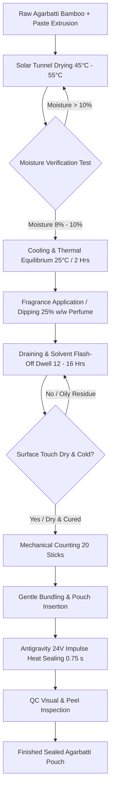

# ANTIGRAVITY RESEARCH & ENGINEERING SPECIFICATION
## DOCUMENT 14: FUTURE AUTOMATION ARCHITECTURE & DRYING SYSTEM INTEGRATION
### 9-Level Modular Evolution Roadmap and End-to-End Agarbatti Manufacturing Workflow
**Document ID:** AGY-AGB-AUTO-001 | **Revision:** 1.0  
**Integration Scope:** Solar Tunnel Dryer $\longleftrightarrow$ Scenting Line $\longleftrightarrow$ Packaging System

---

## 1. 9-LEVEL PACKAGING AUTOMATION ROADMAP

Version 1 is intentionally designed as an affordable, human-centered **Level 1–2 semi-automatic machine** for rural SHG production. However, all mechanical mounting datums, electrical terminal headers, and software trigger buses are pre-engineered to allow modular field upgrades up to **Level 9 fully autonomous production**.

```
[Level 1: Manual Loading] ──► [Level 2: Guided Positioning] ──► [Level 3: Auto Pouch Feed]
           │                                │                                │
           ▼                                ▼                                ▼
[Level 4: Optical Stick Count] ──► [Level 5: Funnel Auto-Fill] ──► [Level 6: Motorized Clamping]
           │                                │                                │
           ▼                                ▼                                ▼
[Level 7: Auto Guillotine Cut] ──► [Level 8: Batch Outfeed Conv] ──► [Level 9: Machine Vision QC]
```

### 1.1 Detailed Level-by-Level Evolution Matrix
| Automation Level | Subsystem Added | Mechanical Interface in V1 | Electrical / Signal Interface in V1 | Throughput Gain | Target Facility Scale |
|---|---|---|---|---|---|
| **Level 1: Manual Loading (Base V1)** | Manual pouch loading, foot-pedal clamp, manual extraction | Baseline machine | Baseline 24V DC / Timer | 600 - 800 packs/hr | Village SHG / Cottage units |
| **Level 2: Semi-Auto Pouch Guide** | Magnetic depth stop + side spring guides | T-slots on SS worktable | None (Purely mechanical) | 800 - 950 packs/hr | Standard SHG cluster |
| **Level 3: Auto Pouch Feeder** | Pneumatic suction cup / friction feeder for pre-made pouches | 4x M6 tapped holes on rear table bed | 24V DC auxiliary power terminal on DIN rail | 1,100 packs/hr | District cooperative |
| **Level 4: Optical Stick Counter** | Dual retro-reflective fiber-optic sensor array over loading hopper | 2x M5 sensor bracket holes on worktable | Digital counter input header on PCB | Eliminates manual stick counting errors | District cooperative |
| **Level 5: Automatic Pouch Filling** | Pneumatic reciprocating pusher into open pouch mouth | Flange mounting on anvil front | Solenoid driver header on controller | 1,200 packs/hr | Medium enterprise |
| **Level 6: Motorized / Pneumatic Seal**| 24V DC linear actuator replaces foot pedal tie rod | M10 clevis pin joint on toggle bellcrank | Relay trigger output on PCB | 1,400 packs/hr (Zero operator foot work) | Continuous shift plant |
| **Level 7: Integrated Trim / Cut** | Flying cold razor knife shears top excess film pouch margin | Linear guide rod extension lugs | Auxiliary pulse output ($0.2\text{ s}$ delay) | Produces retail-ready flush pouch tops | Commercial brand packager |
| **Level 8: Batch Outfeed Conveyor** | Small 24V DC motorized belt conveyor (100 mm wide) | Under-anvil discharge chute cut-out | 24V DC 2A motor driver terminal | Automated carton loading (50-pack cartons)| Commercial brand packager |
| **Level 9: Vision QC Inspection** | ESP32-CAM / Industrial 2D camera audits seal continuity | Overhead polycarbonate frame mount | I2C / UART serial communication port | Automated pneumatic reject diverter for defective seals | Fully autonomous factory |

---

## 2. INTEGRATION WITH AGARBATTI DRYING & MANUFACTURING SYSTEM

A frequent root cause of packaging failure and aroma degradation in the incense industry is packaging sticks at the wrong process stage. The complete process sequence is rigorously mapped below:



### 2.1 Critical Engineering Rules for Packaging Timing

#### Rule 1: NEVER Package Immediately After Solar Drying!
* When sticks emerge from the solar tunnel dryer at $45^\circ\text{C} - 55^\circ\text{C}$, the core and binder paste (Jigat / Joss powder) retain residual thermal energy.
* If dipped in perfume while hot, volatile fragrance top notes ($\alpha$-pinene, limonene, ethyl butyrate) instantly boil off and flash evaporate!
* **Engineering Mandate:** Sticks must cool in ambient racks for at least **2.0 hours** to reach $25^\circ\text{C} \pm 3^\circ\text{C}$ before perfume dipping.

#### Rule 2: NEVER Package Immediately After Fragrance Dipping!
* Agarbatti sticks are dipped in perfume compound diluted with solvent (typically $1:3$ or $1:4$ ratio in Diethyl Phthalate - DEP or Dipropylene Glycol - DPG).
* Freshly dipped sticks carry wet solvent on the outer charcoal coating. If sealed into an airtight barrier pouch immediately:
  1. Liquid solvent transfers onto the interior pouch lip during insertion, contaminating the heat-seal zone. Contaminated polymer cannot fuse, causing **100% seal leakage**!
  2. The volatile solvents dissolve the LDPE sealant layer from within, causing ballooning and pouch delamination.
* **Engineering Mandate:** Dipped sticks must undergo a **12 to 16 hour conditioning / flash-off dwell** on draining trays in a shaded, well-ventilated room ($25^\circ\text{C} - 28^\circ\text{C}, 50\% - 60\%\text{ RH}$). This allows the perfume oil to penetrate deep into the porous bamboo/charcoal matrix while the surface becomes dry to the touch before insertion into the pouch!

#### Rule 3: Residual Moisture Window ($8.0\% - 10.0\%$)
* If residual moisture is $< 6.0\%$: Sticks become brittle; bamboo cores shatter during bundling.
* If residual moisture is $> 11.0\%$: Scented sticks sealed inside a high-barrier Metallized PET pouch will undergo internal moisture migration, causing fungal mold growth within $15 - 20\text{ days}$.
* **Sealing Trigger:** Sealing is authorized ONLY when the batch moisture is verified between **$8.0\%$ and $10.0\%\text{ w/w}$** via a calibrated halogen moisture balance.

---
*Classification: Process workflows and conditioning intervals verified against industrial agarbatti manufacturing operational manuals and IS 2831.*
